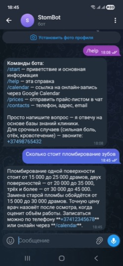
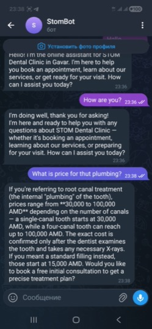
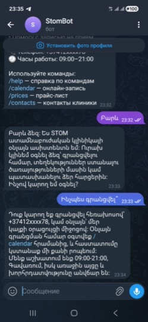

# 🤖 STOM Dental Bot — MVP


Telegram-ассистент стоматологической клиники **STOM** (г. Гавар, Армения). Бот отвечает на вопросы пациентов на языке запроса (мултиязычность), помогает с записью, предоставляет информацию об услугах, ценах и послепроцедурных рекомендациях.

---

## 📁 Структура проекта

```
/Users/macbook/myai/stomdent/
├── .env                          # API-ключи и настройки (НЕ коммитить!)
├── .env.example                  # Шаблон .env файла
├── requirements.txt              # Python-зависимости
├── bot.py                        # Главный файл бота
├── stdn.txt                      # Системный промпт (инструкции для LLM)
├── start_bot.sh                  # Скрипт запуска
├── stop_bot.sh                   # Скрипт остановки
├── README.md                     # Эта инструкция
├── logs/                         # Логи работы бота
│   └── bot.log
└── knowledge/                    # База знаний (Markdown)
    ├── FAQ.md                    # 50 часто задаваемых вопросов
    ├── postop.md                 # Рекомендации после процедур
    └── prices.md                 # Прайс-лист в AMD
```

---

## 🔑 Необходимые API-ключи

Перед запуском нужен один из API-ключей для работы нейросети (LLM):

### Вариант 1 — Ollama (локальная модель, бесплатно, рекомендуется)
Работает полностью на вашем компьютере без интернет-API.

1. Установите Ollama: [ollama.com/download](https://ollama.com/download)
2. Запустите Ollama в терминале:
   ```bash
   ollama serve
   ```
3. Скачайте модель:
   ```bash
   ollama pull llama3.1
   ```
   *Для русского языка также хорошо подходят:* `mistral`, `qwen2.5`, `gemma2`
4. Проверьте: `curl http://localhost:11434/api/tags`
5. В `.env` укажите:
   ```dotenv
   LLM_PROVIDER=ollama
   OLLAMA_MODEL=llama3.1
   ```

### Вариант 2 — Anthropic Claude
1. Зарегистрируйтесь на [console.anthropic.com](https://console.anthropic.com)
2. Создайте API-ключ
3. В `.env`:
   ```dotenv
   LLM_PROVIDER=anthropic
   ANTHROPIC_API_KEY=your_key_here
   ```

### Вариант 3 — OpenAI (резервный)
1. Зарегистрируйтесь на [platform.openai.com](https://platform.openai.com)
2. В `.env`:
   ```dotenv
   LLM_PROVIDER=openai
   OPENAI_API_KEY=your_key_here
   ```

---

## ⚙️ Настройка

### 1. Скопируйте .env.example в .env

```bash
cp .env.example .env
```

Отредактируйте `.env`, вставив свои ключи:

```dotenv
# Telegram Bot API
TELEGRAM_BOT_TOKEN=your_token_here

# LLM Provider
LLM_PROVIDER=ollama

# --- Ollama ---
OLLAMA_HOST=http://localhost:11434
OLLAMA_MODEL=llama3.1

# Google Calendar для записи
GOOGLE_CALENDAR_URL=https://calendar.app.google/your_link
```

### 2. Установите зависимости (один раз)

```bash
cd /Users/macbook/myai/stomdent
python3 -m venv venv
source venv/bin/activate
pip install -r requirements.txt
```

*Или просто запустите `./start_bot.sh` — он создаст venv и установит всё сам.*

---

## 🚀 Запуск бота

### Простой запуск

```bash
cd /Users/macbook/myai/stomdent
./start_bot.sh
```

Что делает скрипт:
1. Создаёт виртуальное окружение `venv` (если нет)
2. Устанавливает/обновляет зависимости
3. Запускает бота в фоне через `nohup`
4. Сохраняет PID в файл `bot.pid`
5. Пишет логи в `logs/bot.log`

### Проверка, что бот работает

```bash
tail -f logs/bot.log
```

Вы должны увидеть:
```
2025-... | INFO | Ollama provider ready (host=..., model=llama3.1)
2025-... | INFO | Bot polling started
```

### Проверка в Telegram

1. Откройте Telegram
2. Найдите бота по токену из `.env`
3. Нажмите `/start`
4. Бот пришлёт приветственное сообщение

---

## 🛑 Остановка бота

```bash
cd /Users/macbook/myai/stomdent
./stop_bot.sh
```

---

## 🔄 Перезапуск

```bash
./stop_bot.sh && ./start_bot.sh
```

---

## 💬 Команды бота

| Команда | Описание |
|---------|----------|
| `/start` | Приветствие и основная информация о клинике |
| `/help` | Список всех команд |
| `/calendar` | Кнопка с ссылкой на онлайн-запись через Google Calendar |
| `/prices` | Отправляет прайс-лист в чат |
| `/contacts` | Телефон, адрес, email, часы работы |

**Произвольный текст** — бот передаёт вопрос в LLM с учётом системного промпта и базы знаний, после чего возвращает ответ.

---

## 🧠 Как работает бот

1. **System Prompt** — загружается из `stdn.txt` (стиль общения, ограничения, данные клиники).
2. **База знаний** — загружается из `knowledge/*.md` (FAQ, рекомендации, цены).
3. **LLM** — получает полный контекст + историю диалога.
4. **История** — хранится в памяти (последние 10 сообщений), при перезапуске бота обнуляется.

---

## 📝 Обновление базы знаний

Отредактируйте соответствующий `.md` файл в `knowledge/` и перезапустите бота:

```bash
./stop_bot.sh && ./start_bot.sh
```

---

## 🛠 Устранение неполадок

### Бот не запускается

```bash
cat logs/bot.log
```

**«TELEGRAM_BOT_TOKEN не найден»** — проверьте, что `.env` лежит в той же папке, откуда запускаете бота.

**«Не удалось подключиться к Ollama»** — убедитесь, что `ollama serve` запущен. Проверьте: `curl http://localhost:11434/api/tags`.

**«Модель 'xxx' не найдена в Ollama»** — выполните `ollama pull llama3.1`.

### Бот запущен, но не отвечает в Telegram

1. Проверьте токен в `.env`
2. Убедитесь, что у бота нет другого активного процесса
3. Попробуйте `/start` ещё раз

---

## 🔒 Безопасность

- **Никогда не публикуйте `.env`** — там хранятся API-ключи.
- **API-ключи LLM** дают доступ к платным запросам — храните их в секрете.
